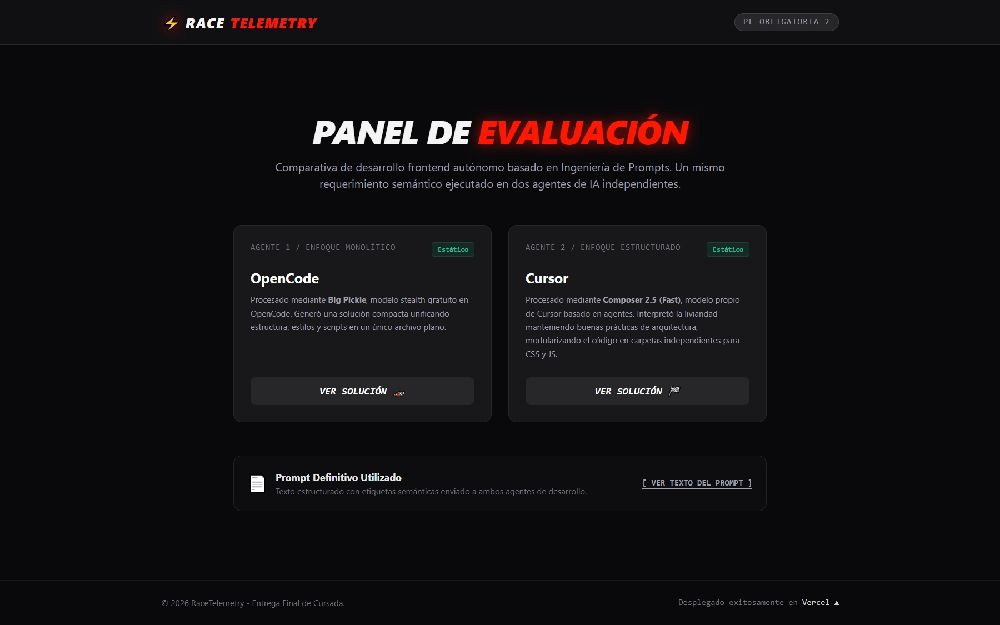
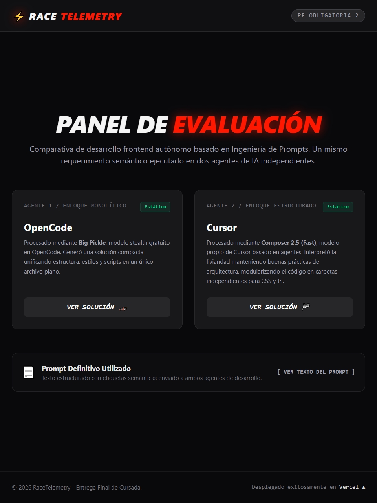
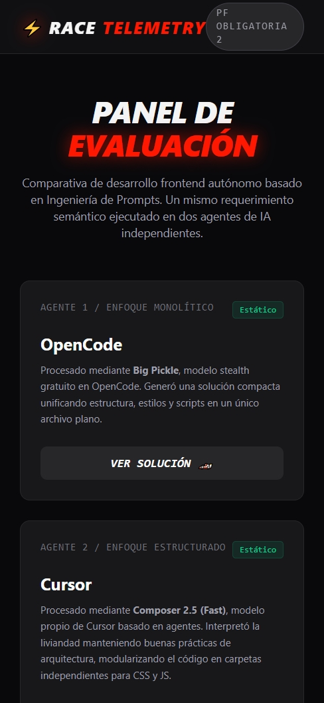
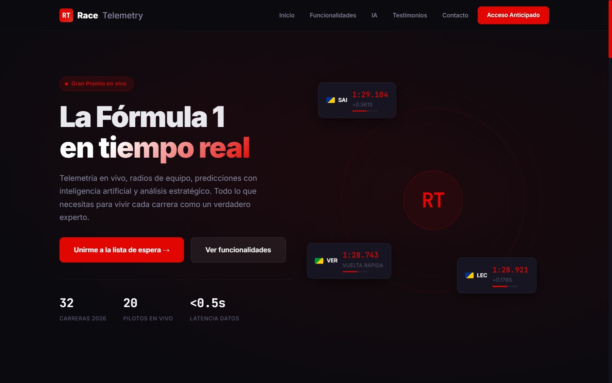
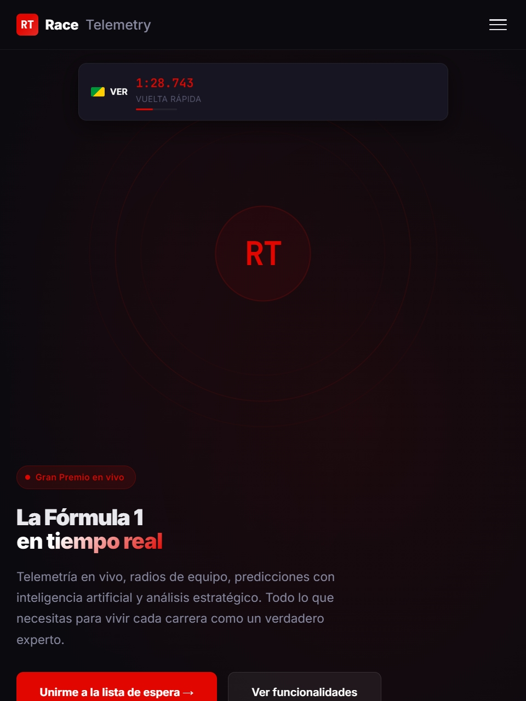
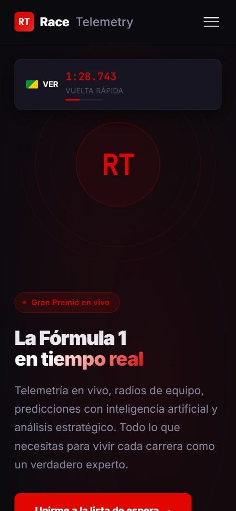
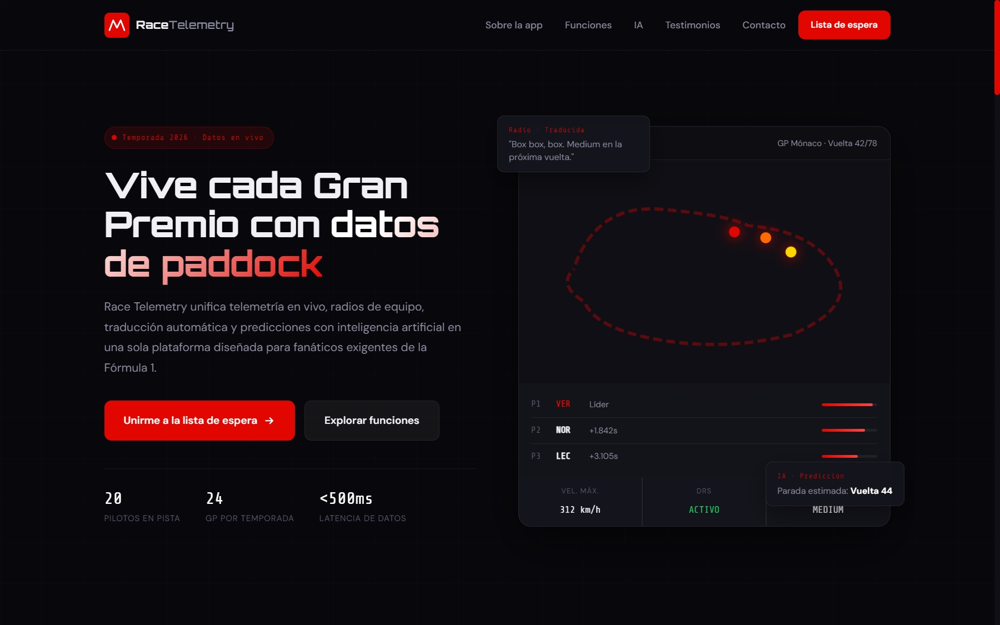
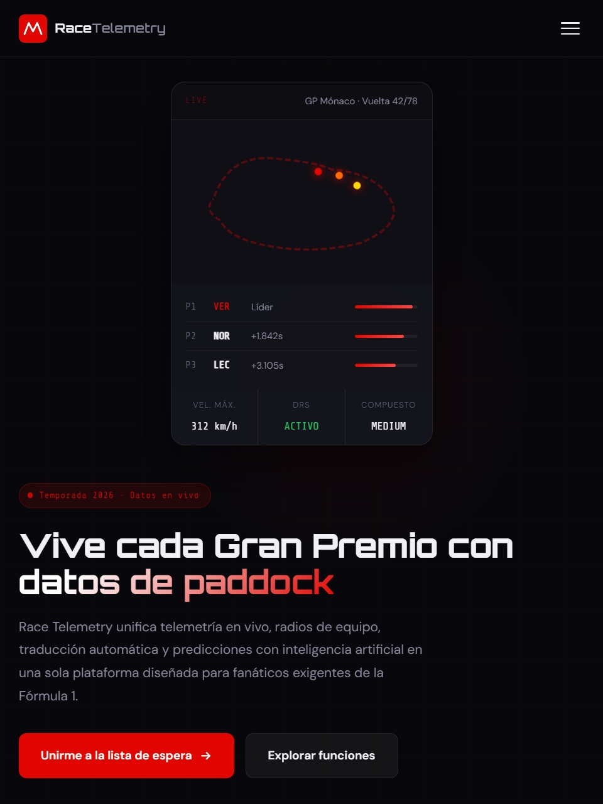
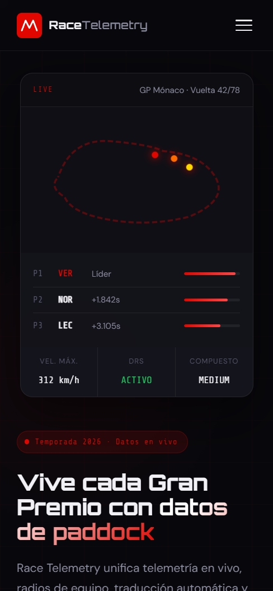

# Práctica Formativa Obligatoria 2 - Prompt Engineering en Agentes de IA

## Datos del estudiante

* Nombre y Apellido: Edison Cristian Vivar
* Materia: Desarrollo de Sistemas Web (Frontend)
* Comisión D

---

## Descripción del trabajo

El objetivo de esta práctica consistió en diseñar un único prompt inicial para generar una Landing Page utilizando agentes de desarrollo asistidos por Inteligencia Artificial.

Se utilizó el mismo prompt en dos agentes diferentes para analizar cómo cada uno interpreta los requisitos y resuelve la implementación de forma autónoma, evitando modificaciones manuales sobre el código generado.

La temática elegida fue **Race Telemetry**, una aplicación orientada a fanáticos de la Fórmula 1 que ofrece telemetría en vivo, radios de equipo traducidas en tiempo real, análisis avanzados y predicciones estratégicas impulsadas por Inteligencia Artificial.

---

## Deploy unificado

**Landing principal (portada):**

(https://racetelemetry.vercel.app/)

Desde esta portada se puede acceder a:

* Prompt utilizado.
* Landing generada por OpenCode.
* Landing generada por Cursor.

---

## Prompt utilizado

```text
<función>
Lee todas las secciones del prompt antes de comenzar la implementación. Quiero que actúes como un desarrollador frontend con experiencia en diseño UI/UX y creación de landing pages modernas. Además de programar, debes tomar decisiones de diseño y contenido para construir una página atractiva, profesional y orientada a captar usuarios.
Tu objetivo es generar una landing page completa para una aplicación llamada Race Telemetry, pensada para fanáticos de la Fórmula 1. No debes pedir información adicional ni dejar partes incompletas. Si algún detalle no está especificado, resuélvelo utilizando criterios razonables de diseño y experiencia de usuario.
</función>
<contexto>
Race Telemetry es una aplicación que busca ofrecer a los fanáticos de la Fórmula 1 una experiencia mucho más completa durante los Grandes Premios.
La idea es reunir en una sola plataforma herramientas que normalmente están distribuidas en distintos servicios, permitiendo seguir la carrera con datos avanzados y análisis en tiempo real.
Entre las funcionalidades principales se encuentran: Telemetría en vivo de todos los pilotos. Radios de equipo en tiempo real. Traducción automática de comunicaciones. Predicciones de estrategia mediante inteligencia artificial. Información sobre neumáticos y paradas en boxes. Comparación entre pilotos. Alertas de incidentes importantes. Estadísticas y datos históricos.
El objetivo de la landing page es generar interés en el producto y convencer al usuario de registrarse o unirse a una lista de espera.
</contexto>
<guia_estilo>
La estética general debe transmitir tecnología, velocidad e innovación.
Tomar como referencia visual aplicaciones deportivas modernas y plataformas tecnológicas premium.
Características deseadas: Diseño oscuro con detalles en rojo inspirados en la Fórmula 1. Apariencia moderna y profesional. Buena jerarquía visual. Animaciones suaves y elegantes. Componentes visualmente atractivos. Diseño completamente responsive. Experiencia optimizada para dispositivos móviles y escritorio.
Paleta sugerida: Negro y gris oscuro como colores principales. Rojo competición para elementos destacados. Blanco para textos y contrastes.
</guia_estilo>
<requisitos>
La landing page debe incluir obligatoriamente las siguientes secciones:
Header. Con logo o nombre de la aplicación, menú de navegación y botón de llamada a la acción.
Hero Section. Debe tener un título principal llamativo, una descripción breve de la propuesta de valor, un botón principal de acción y elementos visuales relacionados con datos de carrera o telemetría.
Sobre la aplicación. Explicación de qué es Race Telemetry, beneficios para el usuario y diferencias respecto a otras alternativas.
Características principales. Mostrar al menos seis funcionalidades mediante tarjetas o bloques visuales.
Inteligencia artificial y análisis. Explicar cómo la IA ayuda a interpretar la carrera y generar predicciones estratégicas.
Testimonios. Incluir al menos tres testimonios ficticios de usuarios con nombre, foto de perfil y comentario.
Formulario de contacto. Debe contener nombre, correo electrónico, mensaje y botón de envío.
No es necesario implementar backend.
CTA final. Una sección destacada que incentive al usuario a registrarse.
Footer. Incluir enlaces a redes sociales con sus respectivos iconos y una breve información de la aplicación.
</requisitos>
<salida>
Instrucciones de salida
Genera la implementación completa de la landing page respetando todos los requisitos anteriores, priorizando la calidad visual, la organización del código y la experiencia de usuario. El resultado debe verse como un producto real listo para ser presentado públicamente. No solicites confirmaciones ni explicaciones adicionales. Genera directamente la solución completa.
No utilizar textos genéricos tipo "Lorem Ipsum". Todo el contenido debe estar relacionado con la temática de Fórmula 1 y Race Telemetry.
</salida>

```
---

## Agentes utilizados

### Agente 1

* Plataforma: OpenCode
* Configuración utilizada: Big Pickle Medio
* Modelo: Big Pickle

Según la documentación oficial de OpenCode, Big Pickle es un modelo experimental (stealth model) disponible de forma gratuita por tiempo limitado mientras el equipo recopila comentarios y continúa mejorando sus capacidades.
https://opencode.ai/docs/es/zen/

### Agente 2

* Plataforma: Cursor
* Configuración utilizada: Composer 2.5 Fast
* Modelo: Cursor Composer 2.5

Según la documentación oficial de Cursor, Composer 2.5 es un modelo propio basado en agentes, diseñado para mejorar el desempeño en tareas extensas, la selección de herramientas, la comprensión de la intención del usuario y la confiabilidad general de las respuestas.
https://cursor.com/es/docs/models/cursor-composer-2-5

---

## Comparación de resultados

Ambos agentes recibieron exactamente el mismo prompt y generaron sus soluciones sin modificaciones manuales posteriores.

Como resultado, tanto OpenCode como Cursor desarrollaron landing pages estáticas que cumplieron con los requisitos funcionales establecidos para la aplicación Race Telemetry.

Las diferencias observadas se manifestaron principalmente en aspectos relacionados con el diseño visual, la organización de los componentes, la distribución de las secciones y la forma en que cada agente interpretó la identidad de la aplicación. Aunque ambos respetaron la temática de la Fórmula 1 y las secciones solicitadas, cada uno propuso soluciones visuales distintas para comunicar la misma idea.

Ambas implementaciones incluyeron correctamente el header, hero section, sección informativa, características principales, inteligencia artificial y análisis, testimonios, formulario de contacto, CTA final y footer, manteniendo además un diseño responsive para diferentes tamaños de pantalla.

La experiencia permitió observar que, incluso utilizando el mismo prompt y tecnologías similares, distintos agentes pueden producir resultados diferentes debido a sus propios criterios de diseño, organización del contenido y generación de interfaces.

---

## Registros Visuales y Comparativa

A continuación se presentan las capturas de pantalla que demuestran el comportamiento de la interfaz y su adaptabilidad (responsividad) en diferentes dispositivos, junto con un recorrido visual completo de cada solución.

### Portada del sitio con ambas soluciones

#### Vista Escritorio ####

#### Vista Tablet ####

#### Vista Móvil ####


---

### Solución 1: OpenCode (Big Pickle Medio)

#### Vista Escritorio ####

#### Vista Tablet ####

#### Vista Móvil ####



---

### Solución 2: Cursor (Composer 2.5 Fast)

#### Vista Escritorio ####

#### Vista Tablet ####

#### Vista Móvil ####



---
---

## Estructura del proyecto

El repositorio se organizó de forma centralizada utilizando un enfoque multi-página estático, permitiendo que un único despliegue en Vercel actúe como contenedor para ambas soluciones evaluadas:

```text
/ (Raíz del repositorio)
├── index.html               # Portada de acceso principal (Panel de Evaluación)
├── README.md                # Documentación técnica del proyecto
├── /opencode                # Solución generada por OpenCode (Big Pickle)
│   └── index.html           # Archivo único monolítico (HTML + CSS + JS)
├── /cursor                  # Solución generada por Cursor (Composer 2.5 Fast)
│   ├── index.html           # Estructura HTML principal
│   ├── /css                 # Estilos independientes generados
│   │   └── styles.css
│   └── /js                  # Lógica y comportamiento dinámico
│       └── main.js
└── /screenshots             # Registros visuales de responsividad y scrolls
    ├── opencode-responsive.jpeg
    ├── opencode-scroll.gif
    ├── cursor-responsive.jpeg
    └── cursor-scroll.gif
```
## Conclusión final

La realización de esta práctica formativa permitió contrastar de manera directa cómo dos herramientas de desarrollo asistido por Inteligencia Artificial procesan y resuelven un mismo requerimiento semántico abierto.

Al refinar el prompt inicial priorizando una directiva de eficiencia ("implementación simple y liviana"), se evidenció que la arquitectura e identidad interna de cada agente influye drásticamente en el resultado final:

OpenCode (Big Pickle) priorizó un enfoque estrictamente directo y compacto, resolviendo toda la landing page dentro de un único entorno modularizado en un solo documento (index.html). Esto demuestra una excelente capacidad para seguir instrucciones de liviandad extrema al pie de la letra.

Cursor (Composer 2.5 Fast), por su parte, demostró una concepción más cercana a un entorno de desarrollo profesional y escalable (IDE). Incluso bajo la premisa de simplicidad, optó de forma autónoma por estructurar el proyecto separando las responsabilidades de código en carpetas independientes (/css y /js), garantizando un mantenimiento futuro alineado con las buenas prácticas tradicionales de la industria.

En conclusión, la Ingeniería de Prompts no solo requiere claridad en el contenido y la guía de estilo, sino también comprender el "comportamiento por defecto" del agente con el que se trabaja. Ambos resultados son completamente válidos, estéticamente competitivos y funcionales, cumpliendo con creces el objetivo de democratizar el desarrollo web mediante el uso estratégico de la Inteligencia Artificial.